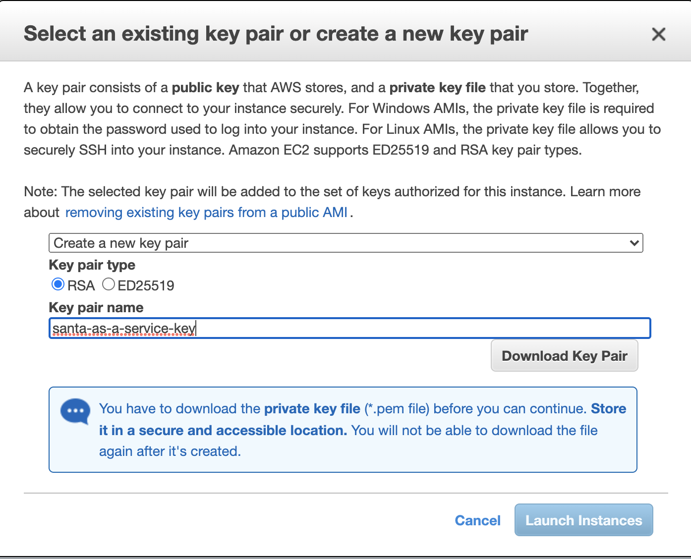
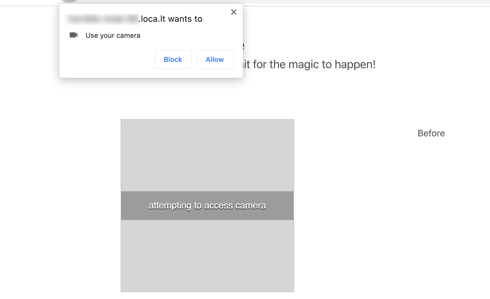

# Face to Face w. AWS Rekognition
**Use Node-RED to build and deploy an app which analyses a face with AWS AI Technologies**

## Intro

Welcome! In this workshop we're going to be building a simple web application with HTML/CSS/JavaScript and Node-RED that will interface with AWS AI services that finds your face and then draws a shows an analysis of what it finds.

**We will cover...**

1. Starting an EC2 server
2. Deploying Node-RED
3. Installing components
3. Building your front-end flow
4. Getting AWS Credentials
5. Adding them to the flow
6. Deploying our application
7. Running our application!

## Starting an EC2 server.

Before spinning up an EC2 server, you will need an [AWS account](https://aws.amazon.com/). If you... 

1. Have one already, sign-in now
2. Are participating in an AWS-run workshop, an account will be provided for you
    1. Go to the [Event Engine Dashboard](https://dashboard.eventengine.run/)
    2. Enter the hash that your instructor gives you to access a temporary AWS account for the duraiton of the workshop
3. Do not have an account, sign up for one [here](https://portal.aws.amazon.com/billing/signup)

### Choosing an AMI

Once logged in, we're going to spin up and EC2 server that we can use to deploy our Node-RED server.

Go to the [EC2 Management Console](https://console.aws.amazon.com/ec2/v2/home?#Instances:v=3) and click on the orange "Launch Instances" button at the top-right of the screen.


You'll be asked to select an Amazon Machine Image (AMI) on the next screen. For this workshop, we're going to use Ubuntu 20.04. Scroll down the list until you see it listed as an option, or use the search bar at the top to find it.


When you find the option in the list, make sure that **"64-bit x86"** is the selected type and then click the blue "Select" button.

### Selecting an Instance Type

Next, we need to select an instance type to run our AMI and software on. We're going to use the `t2.micro` option with 1 vCPU and 1Gb of memory. This should be more than ample to run our application. Click the checkbox next to the `t2.micro` option, then click the grey "Next: Configure Instance Details" at the bottom right of the screen.


### Configuring Instance Details

Here, we can set settings such as the VPC or subnet that our instance will be created in. The default settings here will work for our needs, so leave them as they are and then click "Next: Add Storage" at the bottom-right of the screen.

### Adding Storage

Again, the default storage settings will be more than ample for our applications needs, so click the "Next: Add Tags" button.

### Adding Tags

We don't need to add any tags to our instance, but if you would like to name your instance, you can click "Add Tag" and then enter `Name` as the key and whatever name you'd like to give your instance (maybe `node-red`) as the value. When you're ready, click the "Next: Configure Security Group" button.

### Configuring Seurity Group

Next up, we'll be asked to configure a **Security Group** for our application. You can think of an SG as a firewall of sorts for our instance, enabling us to either allow or deny traffic on certain ports. Port 22 is already enabled for SSH, this will enable us to connect directly to our instance and configure it. We intend to run a web server on this instance too, so we'll need to open up port 80 so web browsers can connect to and receive responses from our server.

Click the grey "Add Rule" button just below our SSH rule. In the **Type** column, select `HTTP`. This will create the rule we need to enable connections to our instances Node-RED installation once we've installed and configured it.


Once you've done that, click the blue "Review and Launch" button at the bottom-right of the screen.

### Launching our Instance

On the next page, we'll see a summary of the options we've configured for our instance so far. Click the "Launch" button to spin up your instance.

You'll be asked to create a keypair to connect to the instance. From the drop down select "Create a new key pair", then give it a name and click "Download Key Pair". 



Once the download has completed, click "Launch Instances".

You will see a new **Launch Status** page telling you that your instances are now launching. Click on the blue hyperlinked intance ID in the grren section of the page to see the details of your launching instance.


After a few minutes, you should see the instance state in the new table view change to **Running**. When this is the case, hit the blue instance ID for your instance to be taken to the details page.


### Connecting to our instance

Once the details page loads, you should see some basic information about our new instance. At the top right of the information section, there is a grey "Connect" button. Click it to see a list of options for connecting to our newly spun-up instance.


Because we used the Ubuntu image to spin up our instance, we're able to use **EC2 Instance Connect**. This will allow us to remotely connect to and control our instance from the browser we're already using. Click the orange "Connect" button to gain access to your instance.


A new tab will open up with a terminal interface, and you should see some basic information about the machine we're running on. We're now ready to start configuing our instance to run Node-RED.


## Deploying Node-RED

To install and access Node-RED, we'll need to also install Node.js and a few other tools that will keep it running. Fortunately, there's a handy script that will do all of this for you.

Copy and paste the following command into your terminal window. This will take care of installing all of the tools we'll need for our workshop, and should take about a minute.

```bash
curl -o- https://raw.githubusercontent.com/nvm-sh/nvm/v0.39.0/install.sh | bash && export NVM_DIR="$HOME/.nvm" && [ -s "$NVM_DIR/nvm.sh" ] && \. "$NVM_DIR/nvm.sh"  && [ -s "$NVM_DIR/bash_completion" ] && \. "$NVM_DIR/bash_completion" && nvm install 16.13.0 && npm i -g node-red && npm i -g localtunnel && npm i -g --unsafe-perm pm2
```

### Running Node-RED

Once you've done that, we're ready to run Node-RED! Copy and paste the following command to start it as a background process. This will enable Node-RED to continue running even if we become disconnected from our session.

```bash
pm2 start `which node-red` -- -v
```

If all went well, you should see a little table telling you that a process with the name `node-red` has started and that it's status is `online`.


### Connecting to our Node-RED instance

Our Node-RED instance is online, but it's not listening on port `80`, it's listening on it's default port of `1880`. If you cast your mind back to the Security Group we created, we only allowed connections to our instance on ports `22` and `80`, so we won't be able to access our Node-RED installation as things stand.

However, we have installed something already that will help us with that: `localtunnel`. localtunnel is an application which can listen on port `80` and forward any requests to it to another port on the system - say `1880`, for example. This gives us a few benefits:

1. We can connect to our Node-RED instance using a `localtunnel` created URL
2. We can access it over a secure (`https`) connection, which we'll need in a bit to access the webcam on our systems.

To start `localtunnel` and enable access to our Node-RED installation, copy and paste the following command. This will start `localtunnel` and give us a URL that we can access Node-RED with.

```bash
pm2 start lt -- --port 1880
```


Then copy and paste the following command

```bash
pm2 logs lt --lines 1 --out --nostream
```


You should see a line saying "your url is <URL>". Copy and paste that URL into a new browser tab.

Once that page is loaded, you should see a friendly message from localtunnel, click the "Click to Continue" button to head to our Node-RED installation.


And voila! You should see Node-RED load up on the page!


## Installing Node-RED Components

Click through the introduction guide until you're presented with the underlying UI. This is the canvas on which we can place our nodes and design our flows. It's here that we'll be building our application, but first we need to install some dependencies to enables us to do that.

At the top right corner of the UI, you will see a hamburger menu item. Click it, and then click on "Manage Palette". 


This will slide open a new piece of the UI where we can manage the additional functionalities that we can install in Node-RED. Click on the "Install" tab.


In the search bar that will appear just below the tab, we can search for components that we want to add to our Node-RED installation. We're going two install different components which will help us build our application.

1. node-red-contrib-aws (Some nodes which make connecting to AWS easier)
2. node-red-contrib-web-components (Some nodes which create web components that makes hooking our front-end and back-end easier)

Enter `node-red-contrib-aws` into the search bar and when a result appears with the exact name in the area below, click the "Install" button. This should take less than a minute. Next, repeat the same steps with `node-red-contrib-web-components`.

When they've both completed, click the red "Close" button just above the "Install" tab we clicked earlier.

## Building our Front-end Flow

In Node-RED, a "flow" represents a group of functionalities that interact with one another. A flow is made up of "nodes", single pieces of functionality that can be combined in any number of combinations to create a program. The first flow we're going to build is going to be made up of HTTP nodes and template nodes.

The HTTP nodes are responsible for receiving requests on a given path, the template nodes will be responsible for constructing what will be included in the response to those requests.

### Responding to HTTP Requests

Let's start with the HTTP node that will accept the request. At the top left of the Node-RED UI, you should see a text field with the place holder "filter nodes" enter `http` in there and the nodes to the left will filter down to the ones we want to use.


We want to use the `http in` node. Click and drag it to somewhere on the canvas. Once you've dropped it, double-click it to configure how it's going to work.


A new panel should slide out where we can configure the functionality. Here we can choose which of the HTTP verbs we want the node to respond to, and we can set which path we want it be accessible on with the `URL` field. Enter `/analyse` (making sure to include the forward slash) in the URL field and then click done. Now this node will respond when an HTTP request comes into our Node-RED instance at the `/analyse` path.

But what is our node going to respond with to a request? Well, a webpage of course! And we can build one in here as well!

### Building our webpage

Go back to the input field where we filtered our nodes before and clear it of any input that's still there. Enter "template" to filter down the nodes to the `template` node. A template node allows us to pass text between nodes that we can change based on certain values, which makes it perfect for dynamically generating webpages on the fly.

Click and drag a template node onto the canvas somewhere to the right of the `http in` node we just added. Once you've dropped it, double-click to configure it. 


#### Adding JavaScript

In this node we're going to put in the JavaScript that our webpage will use pass messages between the front and back ends of our application. First, in the name field enter "JavaSript" - this will name our node in the canvas so we can what it's purpose is at a glance.

Next, change the value of the "Property" field to be `payload.script` instead of just `payload`.

Finally, we're going to copy and paste some JavaScript into the "Template" form just below where we edited the "Name" and "Property" fields.

Copy and paste the following code into the section and then click the red "Done" button.

```javascript
(function () {

    'use strict';
    // Select the camera element in the DOM that responsible for
    // enabling and accessing the webcam
    const camera = document.querySelector('node-red-camera');
    const dataDiv = document.querySelector('#data');

    // When the camera takes a picture, get a copy of it
    // and add it to the webpage.
    camera.addEventListener('imageavailable', function (data) {
        // let img = ''
        const img = ``;
        document.body.querySelector('#pic-before').innerHTML = img;
    });
    
    // Detect whether or not we're on a secure connection and
    // set the websocket protocol (secure or insecure) accordingly
    const wsProtocol = window.location.protocol === "http:" ? "ws" : "wss";
    
    // create a new WebSocket connection to the backend of our application
    const WS = new WebSocket(`${wsProtocol}://${window.location.host}/get-analysis`);
    WS.onopen = function (e) {
        console.log('WS OPEN:', e);
    };

    // receive a message through the WebSocket telling us if any faces were
    // detected in the images we sent.
    WS.onmessage = function (e) {
        console.log(e);
        if (e.data) {
            const sourceImage = document.querySelector('#pic-before img');
            const face_info = JSON.parse(e.data).FaceDetails;

            dataDiv.innerHTML = "";
            
            // For each face we find, work through them and add a bounding box 
            // on top of the source image!
            face_info.forEach(function(face, idx){
                
                var top = face.BoundingBox.Top * sourceImage.height;
                var left = face.BoundingBox.Left * sourceImage.width;
                var width = face.BoundingBox.Width * sourceImage.width;
                var height = face.BoundingBox.Height * sourceImage.height;
                
                var box_elem = '<div class="bounding-box" style="top: '+ top +'px; left: '+ left + 'px; width: ' + width +'px; height: '+ height +'px;">Face ' + idx + '</div>';

                document.body.querySelector('#pic-before').innerHTML += box_elem;

                dataDiv.innerHTML += `<h3>Face ${idx}</h3>`

                if(face['AgeRange']){
                  dataDiv.innerHTML += `<p><strong>Age: </strong>Low: ${face['AgeRange'].Low} High: ${face['AgeRange'].Low}</p>`;
                }

                if(face['Beard']){
                  dataDiv.innerHTML += `<p><strong>Has Beard?: </strong>${face['Beard'].Value === true ? "Yes!" : "No!"}</p>`;
                }

                if(face['Eyeglasses']){
                  dataDiv.innerHTML += `<p><strong>Has Glasses?: </strong>${face['Eyeglasses'].Value === true ? "Yes!" : "No!"}</p>`;
                }

                if(face['Smile']){
                  dataDiv.innerHTML += `<p><strong>Is Smiling?: </strong>${face['Smile'].Value === true ? "Yes!" : "No!"}</p>`;
                }

                if(face['Sunglasses']){
                  dataDiv.innerHTML += `<p><strong>Has Sunglasses?: </strong>${face['Sunglasses'].Value === true ? "Yes!" : "No!"}</p>`;
                }

                if(face['Emotions']){
                  
                  face['Emotions'].forEach(function(emotion){
                    
                    dataDiv.innerHTML += `<p><strong>Is feeling ${emotion.Type.toLowerCase()}?: </strong>${emotion.Confidence > 75 ? "Yes!" : "No!"}</p>`;

                  });

                }

            });
            
            console.log(face_info);
            
        }
    };

    // If the websocket connection is closed,
    // log out the reason why.
    WS.onclose = function (e) {
        console.log('WS CLOSE:', e);
    };

    // If the websocket connection is closed,
    // log out the reason why.
    WS.onerror = function (e) {
        console.log('WS ERROR:', e);
    };

}());
```

Now that we have our JavaScript sorted, lets add some CSS and HTML the same way.

#### Adding CSS

Just the same as before, drag a new template node onto our canvas and drop it to the right of our JavaScript node, then double-click it to configure it's functionality.


This time, name your node `CSS` and replace `payload` with `payload.style` in the "Property" field.

Then, copy and paste the following CSS into the area and click the red "Done" button.

```css
h3{
  font-weight:800;
  margin-top:1em;
}

#pic-before {
    width: 640px !important;
    height: 480px !important;
    position: relative;
    overflow: hidden;
    flex: 0 0 640px;
}

.bounding-box {
    position: absolute;
    display: block;
    background-size: 100% 100%;
    background-repeat: no-repeat;
    border: 3px solid white;
    color: white;
}

.bounding-box img {
    position: absolute;
    display: block;
    width: 100%;
    height: 100%;
    top: 0;
    left: 0;
}
```

#### Adding HTML

Finally, we need to add some HTML that can contain the JavaScript and CSS that we've just written. Once again, add another template node to the canvas to the right of the CSS node then double-click it to configure it.

This time, name your node `HTML` but leave `payload` in the "Property" field.

Then, copy and paste the following HTML into the area and click the red "Done" button.

```html
<!DOCTYPE html>
<html>

<head>
  <meta charset="utf-8">
  <meta name="viewport" content="width=device-width, initial-scale=1">
  <title>Face to Face w. AWS Rekognition</title>
  <link rel="stylesheet" href="https://cdnjs.cloudflare.com/ajax/libs/bulma/0.7.2/css/bulma.min.css">
  <style type="text/css">{{{payload.style}}}</style>
  
  <script defer src="https://use.fontawesome.com/releases/v5.3.1/js/all.js"></script>
    <script src="https://unpkg.com/@webcomponents/custom-elements"></script>
    <script src="https://unpkg.com/@webcomponents/shadydom"></script>
  <script src="/web-components/camera"></script>
</head>

<body>
  <section class="section">
    <div class="container">
      <h1 class="title">
        Face to Face w. AWS Rekognition
      </h1>
      <p class="subtitle">
        Take a picture of yourself to get an analysis of your face
      </p>
    </div>
  </section>
  <section class="section">
    <div class="columns">
      <div id="upload" style="width:50%">
        <node-red-camera data-nr-name="image-capture" data-nr-type="still"></node-red-camera>
      </div>
      <div id="pic-before" class="column">
        Before
      </div>
    </div>
  </section>

  <div id="data"></div>

  <script>
    {{{payload.script}}}
  </script>
</body>

</html>
```

Looking at the above code, notice the `{{{payload.style}}}` and `{{{payload.script}}}` lines. These are not HTML, but placeholder that will be replaced by the content of the CSS and JavaScript nodes that we just created, thus creating our complete web page!

#### Responding to the HTTP Request

Just as we had an `http in` node to receive HTTP requests made to our Node-RED installation, we also need a new `http response` node which can respond to those requests once we've done something with them - for example, our web page.

Go back to the "filter nodes" area and enter "http" one more time to filter the nodes. This time, drag a `http response` node onto your canvad to the right of the `HTML` node we created just a moment ago. We don't need to configure this node, it just knows what to do, so don't double-click it to configure it.


#### Hooking it all up

Now we have all of the components that will make up our web page and it's functionality, we need to connect them to each other. As things stand, only the `http in` node will function, responding to HTTP requests on the `/analyse` path - but that's because it's an input node - it's triggered by some external functionality outside of our flow, in this case, an HTTP request. The rest of our nodes need to be explicity triggered by an input that we define.

But how do we do that? Why, by connecting them up, of course! You may have noticed that our nodes have little grey squares on either both of one side of them. These boxes are the inputs and outputs for the nodes; inputs on the left, outputs on the right. Node can be connected each other to pass information between one another by clicking on the output of one node and dragging it to the input on one or more nodes.

Let's try this now. Go back to the canvas and click on the output box (on the right side) of the `http in` node then drag to draw a line to the input (left side) node of the `JavaScript` node, then release. This will draw a line between the two nodes connecting them to one another. Now the output of the `http in` node will feed into the input of the `JavaScript` node.


Do this for all of the nodes from left to right, so `http in` -> `JavaScript` -> `CSS` -> `HTML` -> `http response`.


Once you've connected all of the nodes, click the big red "Deploy" button at the top-right of the Node-RED interface. This will save our flow and all of the functionality within it.

#### Viewing our Front-end

Now that we've deployed our flow, our web page should be viewable on the `/analyse` path of our Node-RED installation. Copy at paste the URL of the webpage we're currently on up to `/#` (but don't include the `/#`) and paste it into the URL field of a new tab in your browser. Before you try to navigate to the page, add `/analyse` to the URL we just copied and then go to that page.


You should see a very basic web page with some text and an area for our camera to show the current feed. Click the grey box to enable the webcam and click "Allow" when your browser asks for permission to use your webcam. After a few seconds, you should see a live feed of your camera in the webpage. Smile!



But other than showing our camera feed, this webpage doesn't do too much, we still need to build a back-end to take those pictues and do something clever with them. So, let's build a back-end!

### Building our Back-end

#### Recieving Images from the Front-end
Head back to the Node-RED interface and filter the nodes again, this time with the keyword "camera". A bright yellow node should appear called `component-camera` - click and drag that onto our canvas just below our `http in` node and then double-click to configure it. Give your node a name if you wish, but for Connection ID enter `image-capture` and then click "Done". 


This node is special, it's a little bit magic. Using the `node-red-contrib-web-components` package that we installed before, it uses the connected ID to automatically connect to the camera section of the webpage on our front-end. If you look back at the HTML code we copied and pasted above, you can see it has an attribute `data-nr-name="image-capture"`. This is the attribute that links the camera element on the page to the node on the backend of the application. Now, any picture we take with the camera in the webpage will automatically be sent to the node on the back-end where we can manipulate and pass it on.

#### Manipulating our Webcam Data

Before we can send off our image to AWS for face detection, we first need to maniupulate the way we pass it on a little with a tiny bit of JavaScript. This won't be like before where we pass JavaScript to be included on the front-end of our webpage, this is JavaScript that will be run on the back-end of our application, allow us to manipulate data as it moves between our nodes. We need to do this because the way that our camera outputs the images from our front-end isn't the way that AWS expects it to be passed to it.


Go back to our nodes filter and search for "function". This should show one orange "function" node. Click and drag it onto our canvas just to the right of our yellow `Component Camera` node and then double-click to configure it.

Delete the text which reads `return msg;`, then copy and paste the following code into the same field.

```javascript
msg = {
    Image: {
      Bytes: msg.payload
    },
    Attributes: ["ALL"]
};

return msg;
```

This will restructure the data into a format that the AWS nodes will understand when they receive the image. Connect the output of the `Component Camera` module to the input of the `function` node we just configured.

#### Sending off the Image to AWS

Now that have a way of our front-end sending an image from our webcam to the back-end, and that data is formatted to send over to AWS, it's time to bake some functionality in to connect our back-end to AWS services!.

Go back to the filter section of our Node-RED UI and search for `rekognition` (with a 'k'). You should see a node called `AWS Rekognition`, click and drag it onto our canvas to the right of our `function node` and then double-click to configure it.


For the "Operation" dropdown, select **"DetectFaces"**. This tells our node to take whatever image it receives and pass it on to the AWS Rekognition service to find any faces it finds in said image. Before we can do that, we need to get some credentials which will let us authenticate our Node-RED instance with our AWS accounts. 

##### Getting AWS Credentials

To do this, we can use AWS Identity and Access Management (IAM) to create and manage credentials that we can use for our Node-RED instance. In these next steps, we'l create a "User" for programmatic access to AWS services that can generate the credentials we need.


In a new tab, go to the [IAM Console](https://console.aws.amazon.com/iam/). Once the page loads, click on "Users" in the menu on the left-hand side of the page.


Click on the blue "Add Users" button at the right-hand side of the display. 


Give your new user the name "northcoders-saas-workshop" and then click the check box next to **"Access key - Programmatic access"** before clicking the blue "Next: Permissions" button at the bottom-right of the screen.


Next we'll be asked to set permissions for the user, but we're not going to do that right now. Instead, click the blue "Next: Tags" button at the bottom-right of the screen and then click the blue "Next: Review" button that takes its place. Finally, click "Create user".


On the next view, we'll see that our user has been created and that we've been given an **Access key ID** and a **Secret Access Key**. Copy and paste these somewhere for later - **Don't lose them**, once we close the page you **can't access these credentials again**. Once you've saved your credentials, click the "Close" button at the bottom right of the screen.

##### Adding a Policy

Once we close the previous view, we'll see a list of all of the users in our AWS account (there shouldn't be many). Click on the `northcoders-saas-workshop` user we just created to see details about it.


Once the view loads, click the "Add inline policy" button at the bottom-right of the large blue section in the middle of the screen. This will enable us to add access to certain services for our user. 


Click on the "JSON" tab at the top of the new view that loads, and then copy and paste the following JSON into the text field that appears, then click "Review policy" at the bottom of the screen.

```json
{
    "Version": "2012-10-17",
    "Statement": [
        {
            "Effect": "Allow",
            "Action": [
                "rekognition:DetectFaces"
            ],
            "Resource": "*"
        }
    ]
}
```


This will give our user the ability to specifically use the **Detect Faces** functionality of the AWS Rekognition services without giving wider access to the Rekognition service or other AWS services. Only ever authorise the functionality you need!

Next, you'll be asked to add a name for your policy. Enter `rekognition-detect-faces` and then click "Create policy". Now our `northcoders-saas-workshop` user will have the access to the Detect Faces API of the Rekognition service, and the credentials we copied earlier will enable our Node-RED installation to access the Rekognition service.

Close this tab and head back to our Node-RED tab.

##### Adding our Credentials to Node-RED

The configuration panel for our `rekognition` node should still be open. Click the pen icon next to "Add new amazon config" to edit the credentials this node will use.


Copy the Access Key Id that we saved earlier into the **Access Id** field and the Secret Access Key we saved earlier into the **Secret Key** field, then click the red "Add" button, and the red "Done" button that appears afterwards. 


Our node is now configured to securely communicate with AWS Rekognition. Now, when an image is passed to the node, it will be sent to AWS for analysis and will output a JSON object describing what faces, if any, it found in the image. If you haven't done so already, connect the output of the `function` node to the input of your `rekognition` node.

All that remains to be done now is the send that information back to our front-end!

#### Sending the Results to our Front-end

Once we've recieved the results from AWS, we need some way to get that information back to our application. Unlike when we load our web page, we didn't use an HTTP request to send our image to the server, we used the component camera node, so we have no way to send a response to our front-end.

Fortunately, we have Websockets!

Websockets are technology baked into almost all modern web browsers which enables persistent, bi-directional communication between a webpage and a web server, and Node-RED is able to use websockets to send information to our webpage.

For one last time, go back to the filter nodes section of the Node-RED UI and search for "websocket". When the list filters down, click and drag a `websocket out` node to the right of your `rekognition` node and double-click to configure it.

In the new panel that appears, click the pen icon next to "Add new websocket listener".


In the "path" field enter `/analyse`. This will create a websocket listener on the `/analyse` path of our server which our front-end will be able to connect to. Click the red "Add" and then "Done" buttons to finish configuring the websocket node.


We now have everything we need to find our faces, draw a bounding box, and analyse our faces! Hit the big red "Deploy" button at the top right of the Node-RED UI and then then go back and reload your front-end.

### Analysing yourself

And that's it! Take a picture of yours or someone elses face and after a few seconds, you should see some info!

